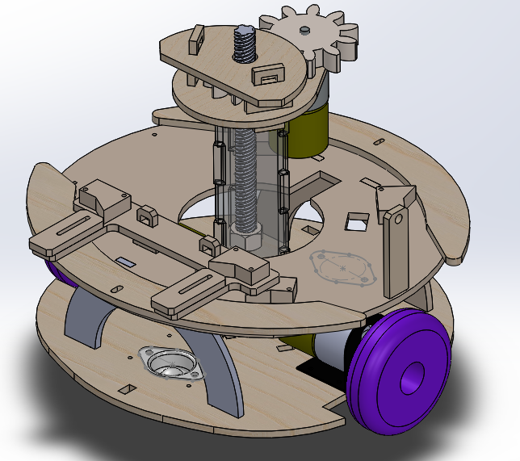

# Mechatronics
## Creating Luke Skyscraper

The task for this year's mechatronics assignment was to 
create a bot which could navigate a field, find targets, and
shoot ping-pong balls through them. That's about it.

Of course we had to fabricate the sensors, design the robot,
and write the state machine to make that happen. Our solution 
was quickly named Luke Skyscraper, a bot which could change its
height using some threaded rod and a DC motor.

Lessons were learned, fun times were had, and sleep was lost

- Carl Lindquist, Cain Martinez, and Babak Khorsand
	Grime Row, BE 115
 
